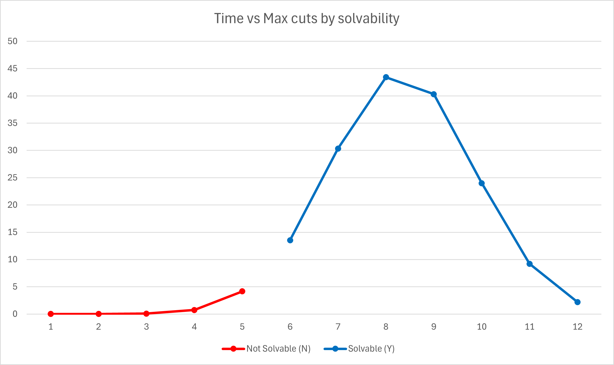

# Graph-partitioning

## Documentation

### Problem description

The graph partitioning problem asks whether it is possible to partition a graph into $k$ subsets while minimising cuts (edges between the subsets) for a given graph and a $k > 0$.

An example of a valid input formal is:

```
3
4
1 2 5
2 1 3 4
3 2 4
4 2 3 5
5 1 2 4
```
where the first line is the number of subsets $k$, the second number is the maximal number of cuts $C$ and the folowing lines represent each vertex (first number) and it's neighbours (here, vertex $1$ is connected to vertices $2$ and $5$).

This particular example gives the following result:

```
Vertex 1 is in subset 3.
Vertex 2 is in subset 1.
Vertex 3 is in subset 2.
Vertex 4 is in subset 1.
Vertex 5 is in subset 1.
Edge (1, 2) is a cut.
Edge (1, 5) is a cut.
Edge (2, 3) is a cut.
Edge (3, 4) is a cut.
```

### Encoding

The problem is encoded using two sets of variables. Variables $Vertex(u, i)$ represent that vertex $u$ is in subset $i$. Variables $Cut(e)$ represent that an edge $e(u, v)$ between vertices $u$ and $v$ is a cut.

To represent the decision problem if there is a solution to partitioning a given graph into $k$ subsets with less than $c$ cuts, we use the following constrains:

- Vertex $u$ is in at least one subset:

    - $\bigvee_{i<k} Vertex(u,i)$
    
    - where $k$ represents the number of subsets.

- Vertex $u$ is at most in one subset:

    - $\forall{\ (1\le i< j\le k)}:(\neg Vertex(u,i) \vee \neg Vertex(u,j))$

    - where $j$ and $l$ represent subsets.

- Every subset must be non-empty:

    - $\forall{i}:\ \bigvee_{u\in V} Vertex(u,i)$

    - where $V$ represents the set of vertices in a graph.

- Edge $e$ connecting vertices $u$ and $v$ is a cut, if and only if $u$ and $v$ are in different subsets:

    for all edges $e$:
    - If $u$ and $v$ are in the same subset, the edge $e(u, v)$ is not a cut:

        - $\forall _{i < k} \neg Vertex(u,i) \lor \neg Vertex(v, i) \lor \neg Cut(e)$
    
    - If $u$ is in subset $i$ and $v$ is not, the edge $e(u, v)$ is a cut:

        - $\forall _{i < k} \neg Vertex(u, i) \lor Vertex(v, i) \lor Cut(e)$
    
    - If $v$ is in subset $i$ and $u$ is not, the edge $e(u, v)$ is a cut:

        - $\forall _{i < k} Vertex(u, i) \lor \neg Vertex(v, i) \lor Cut(e)$
    
        where $k$ represents the number of subsets.

- The number of cuts $\le C$:

    - $\forall (M\subseteq E, |M| = C + 1):\bigvee_{e \in M}\neg Cut(e)$

    - where $E$ represents the set of edges in a graph.

## User documentaion
Basic usage:
```
python3 graph_partitioning.py [-h] [-i INPUT] [-o OUTPUT] [-s SOLVER] [-v {0,1}]
```

Command-line options:

* `-h`, `--help`: Show a help message and exit.
* `-i INPUT`, `--input INPUT` : The instance file. Default: "input.in".
* `-o OUTPUT`, `--output OUTPUT` : Output file for the DIMACS format (i.e. the CNF formula).
* `-s SOLVER`, `--solver SOLVER` : The SAT solver to be used.
*  `-v {0,1}`, `--verb {0,1}` :  Verbosity of the SAT solver used.

## Example instances

* `easy-4-vertices.in`
* `easy-5-vertices.in`
* `easy-5-vertices-UNSAT.in`: Two subsets with maximally 1 cut but every vertex is connected with two other vertices
* `easy-12-vertices.in`
* `hard-12-vertices.in`
* `no-edges.in`
* `no-edges-UNSAT.in`: Trying to find 6 non-empty subsets for 5 vertices without edges.

## Experiments

Experiments were run on AMD Ryzen 7 5800H CPU (3.20 GHz) and 16 GB RAM on Ubuntu inside WSL2 (Windows 11). Time was measured by the SAT solver itself as real time.

We focus on the graph from input hard-12-vertices.in and modulate the number of maximum cuts.

| Max. cuts | Time (s) | Solvable? |
| --------: | :------- | :-------: |
| 1 | 0.00900578 | N |
| 2 | 0.010942 | N |
| 3 | 0.085937 | N |
| 4 | 0.737128 | N |
| 5 | 4.15099 | N |
| 6 | 13.5369 | Y |
| 7 | 30.341 | Y |
| 8 | 43.4211 | Y |
| 9 | 40.3026 | Y |
| 10 |23.9989 | Y |
| 11 | 9.20566 | Y |
| 12 | 2.20215 | Y |


